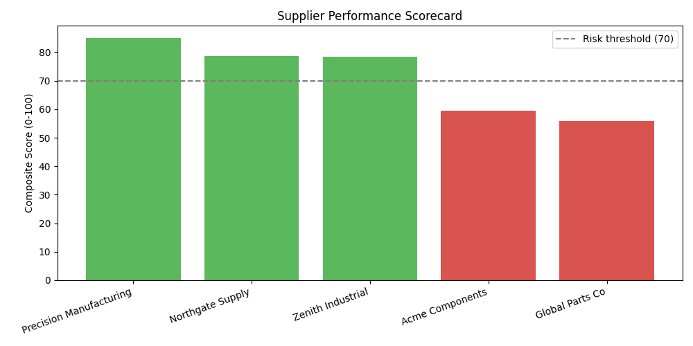
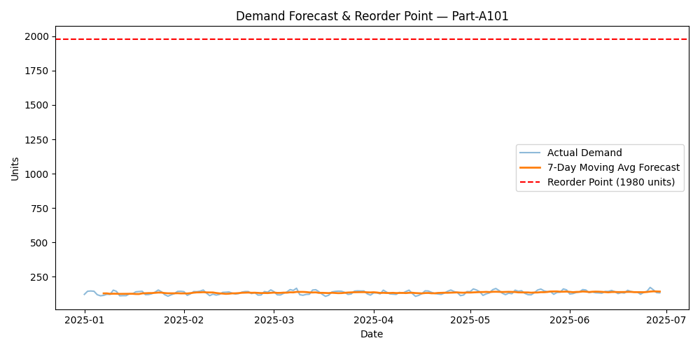
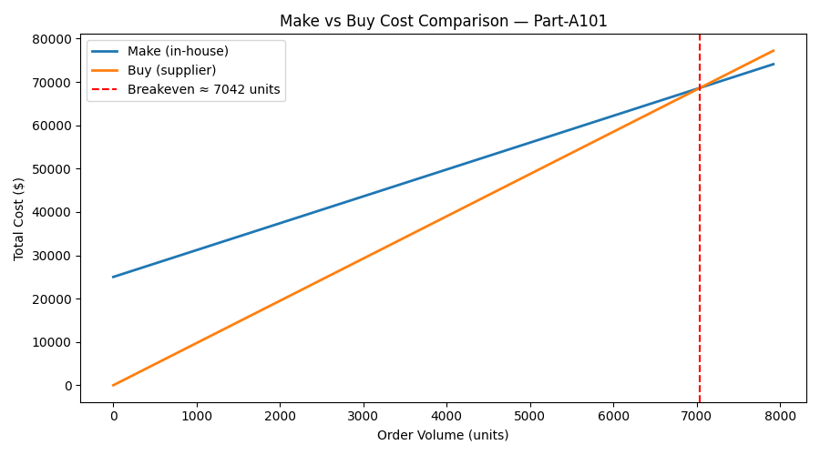

# Supply Chain Analytics Toolkit

A set of three Python tools that support common supply chain / materials
management decisions: demand forecasting & inventory planning, make-vs-buy
outsourcing analysis, and supplier performance (KPI) tracking.

## Why this project

Built to demonstrate practical skills relevant to supply chain / materials
management roles: demand forecasting, MRP-style inventory planning, make vs.
buy analysis for outsourcing decisions, and supplier performance monitoring
through KPIs.

## Modules

### 1. Demand Forecasting & Reorder Point (`module1_demand_forecast.py`)
- Forecasts near-term product demand using a 7-day moving average.
- Calculates **safety stock** and **reorder point** from demand variability
  and supplier lead time — standard MRP inventory-planning formulas — to
  help minimize inventory exposure while avoiding stockouts.
- Outputs a forecast-vs-actual chart per product.

### 2. Make-vs-Buy Analysis (`module2_make_vs_buy.py`)
- Compares in-house production cost (fixed + variable cost) against
  supplier pricing (buy cost).
- Calculates the **breakeven volume** where both options cost the same.
- Recommends Make or Buy for each part based on expected order volume —
  supporting outsourcing decisions.

### 3. Supplier Performance Scorecard (`module3_supplier_scorecard.py`)
- Scores each supplier on delivery, quality, and cost using a weighted
  composite KPI (0-100 scale).
- Flags suppliers falling below a risk threshold for review.
- Outputs a ranked scorecard chart.

## Tech Stack
- Python 3
- pandas, numpy, matplotlib

## How to Run

```bash
# 1. Install dependencies
pip install -r requirements.txt

# 2. Generate the sample dataset (creates data/demand_history.csv and data/suppliers.csv)
python3 data/generate_data.py

# 3. Run each module
python3 module1_demand_forecast.py
python3 module2_make_vs_buy.py
python3 module3_supplier_scorecard.py
```

All charts and summary CSVs are saved to the `outputs/` folder.

## Sample Output

**Supplier Scorecard**


**Demand Forecast & Reorder Point**


**Make vs Buy Cost Comparison**


## Project Structure
```
supply-chain-project/
├── data/
│   ├── generate_data.py
│   ├── demand_history.csv
│   └── suppliers.csv
├── outputs/                 # generated charts & CSV summaries
├── module1_demand_forecast.py
├── module2_make_vs_buy.py
├── module3_supplier_scorecard.py
├── requirements.txt
└── README.md
```

## Notes
- Data is synthetically generated to demonstrate the analysis methods;
  swap in real historical demand / supplier data to use this on an
  actual dataset.
- Assumptions (lead time, service level, KPI weights) are configurable
  at the top of each script.
